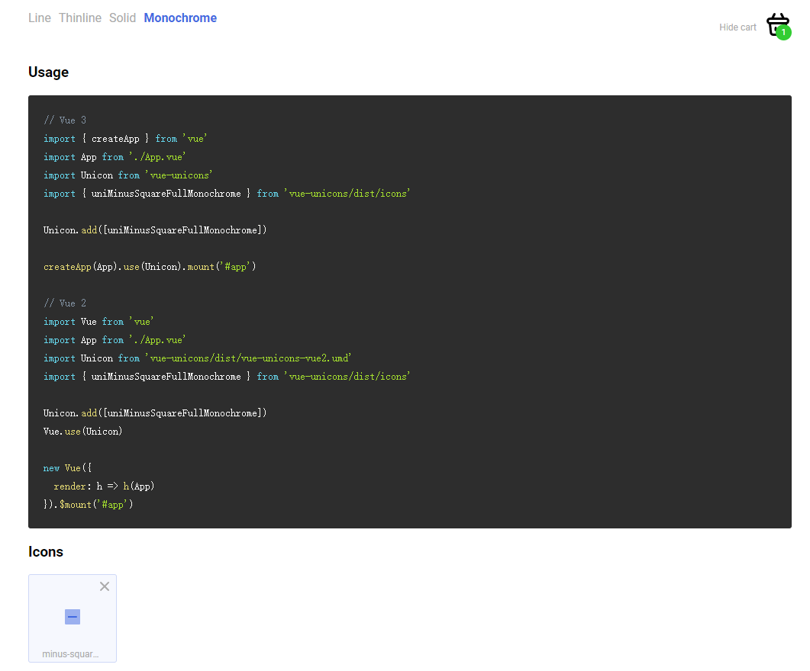

# Tauri 无边框窗口+系统托盘

1. 导入vue-unicons
   执行 npm i vue-unicons

   https://github.com/antonreshetov/vue-unicons
2. 编写icons.js，里面写定制的图标<br>
  基本格式：
   ``` javascript
   export const icons = [
   {
        name:'connect',
        style: 'line/monochrome',
        path: '<path  d="M 18 0 L 0 12 L 13 15 L 12 24 L 26 12 L 16 10 L 18 0"></path>'
    }
   ]
   ```
   style有两个值：line和monochrome，默认的是line，使用时必须正确声明icon-style，否则不显示（line可以不显式声明）

3. 编写main.ts引入需要的图标（注意ts和js不一样，ts要把引入的文件拓展名写全）
    ```typescript
   import Unicon from 'vue-unicons'
   import { uniCopyAlt, uniCopyLandscape,uniWindowSection, uniWindowMaximize, uniCommentMonochrome,uniMultiplyMonochrome,uniMinusSquareFullMonochrome } from 'vue-unicons/dist/icons.js'
   import {icons} from "./icons.js"
   icons.push(
   uniCopyAlt,
   uniCopyLandscape,
   uniWindowSection,
   uniWindowMaximize,
   uniCommentMonochrome,
   uniMultiplyMonochrome,
   uniMinusSquareFullMonochrome
   );
   Unicon.add(icons)
   
   createApp(App).use(Unicon).mount("#app");
    ```
    ```javascript
   import Unicon from 'vue-unicons'
   import { uniCopyAlt, uniCopyLandscape,uniWindowSection, uniWindowMaximize, uniCommentMonochrome,uniMultiplyMonochrome,uniMinusSquareFullMonochrome } from 'vue-unicons/dist/icons'
   import {icons} from "./icons"
   icons.push(
   uniCopyAlt,
   uniCopyLandscape,
   uniWindowSection,
   uniWindowMaximize,
   uniCommentMonochrome,
   uniMultiplyMonochrome,
   uniMinusSquareFullMonochrome
   );
   Unicon.add(icons)
   
   createApp(App).use(Unicon).mount("#app");
    ```
4. 引入自定义的图标<br>
    注意：为了正确定位svg图标，请确保要添加的图标的viewBox必须是"0 0 宽 高"
    ```html
    <unicon class ="top" viewBox="0 0 1024 1024" name="window-on-top" />
    ```
    自定义css指南：指定颜色用fill,path stroke

    应用css无效，发现vue样式中的`<style scoped>`的scoped去掉就可以了
5. 修改库里的图标<br>
   图标搜索地址：https://antonreshetov.github.io/vue-unicons/

   以最小化图标为例：<br>
   我们导入uniMinusSquareFullMonochrome后，该如何使用？不知道name..
   此时利用Ide的源码跳转功能，按住Ctrl点击名称进入源码：
   看到了name，就可以使用了：
   ```html
   <unicon class ="min"  name="minus-square-full" icon-style="monochrome"/>
   ```
   结果发现有个灰色背景：<br>
   然后看源码或者f12分析都可以发现，它有两个path，一个背景一个是前景，还贴心的给了class名称。
   <br>
   就可以自定义了：
   ```css
   .min .uim-primary{
     fill: black;
   }
   .min .uim-tertiary{
     fill: #e7dbdb00;
   }
   ```